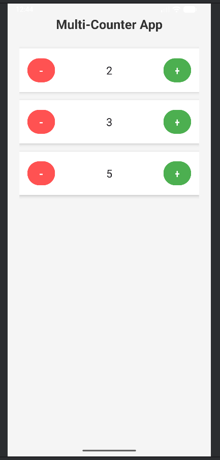

# Multi-Counter App

A clean, modern **Android counter app** with **3 independent counters** built in **Kotlin + XML**.

Each counter has:
- **Editable text field** (type any starting number)
- **+** and **–** buttons
- Real-time updates
- Independent state

Perfect for learning Android UI, `findViewById`, and reusable layouts!

---

## Screenshots

  
*Three independent counters in action*

---

## Features

| Feature | Done |
|-------|--------|
| 3 counters in a column | Yes |
| + / – buttons | Yes |
| Editable starting value | Yes |
| Independent counting | Yes |
| Clean Material Design | Yes |
| No crashes | Yes |

---

## How to Run

1. **Clone the repo**
   ```bash
   git clone https://github.com/your-username/counterapp.git
